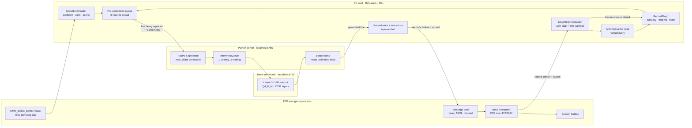
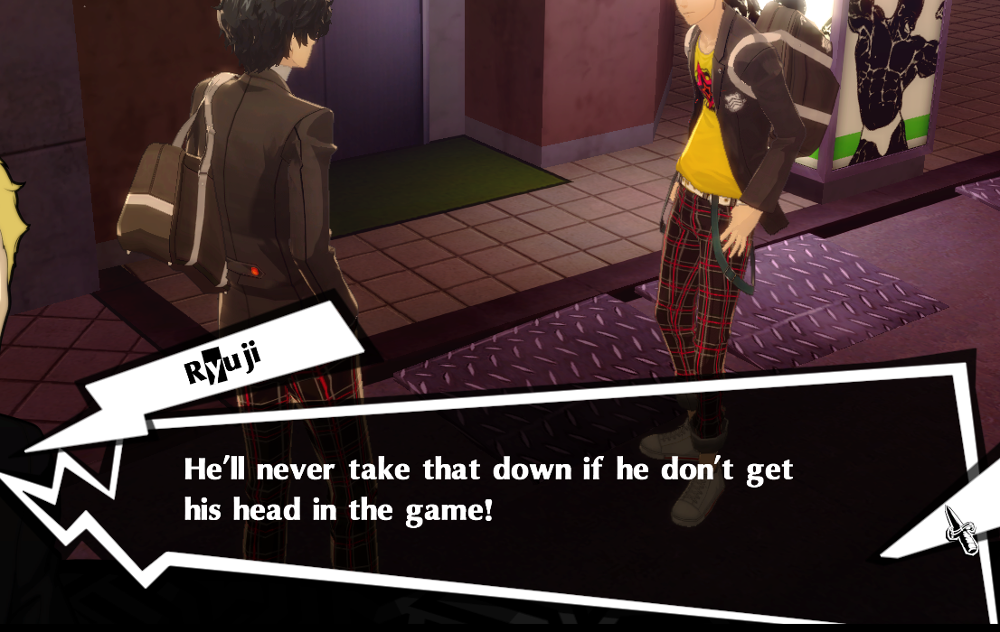
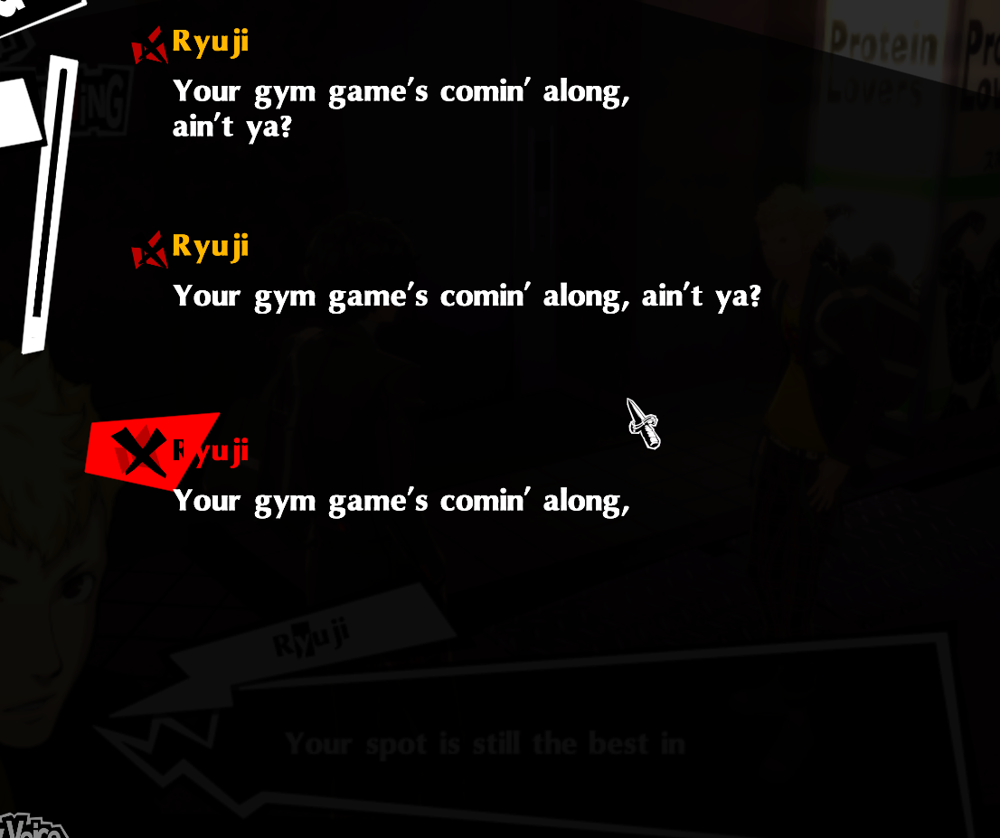
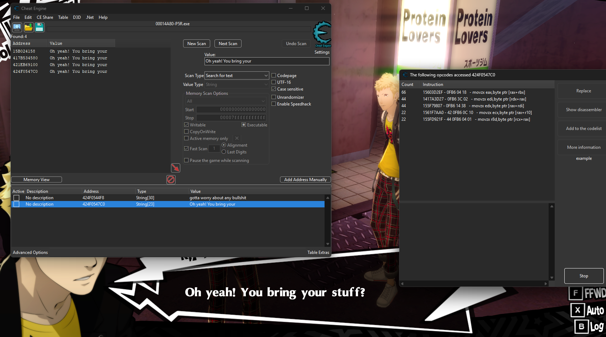

# P5R Generative Social Links

> *What if Ryuji actually remembered what happened last time you hung out?*

A [Reloaded-II](https://reloaded-project.github.io/Reloaded-II/) mod that replaces Persona 5 Royal's scripted Social Link dialogue with live AI generation — running entirely on your local GPU. No cloud, no API keys, no internet. Every conversation is unique.

[](https://github.com/SrijanSuresh/p5r-gen-social-links/actions/workflows/ci.yml)


---

## For people who haven't touched a compiler

Persona 5 Royal has 22 Social Link characters — Ryuji, Ann, Makoto, and so on. Every line they say is pre-written, fixed forever in the game's script. This mod hooks into the game's memory while it's running, reads who you're hanging out with and how close you are, sends that to a small AI model running on your own PC, and gets back a reply that sounds like that character at that moment in your relationship.

**Ryuji at Rank 4, gym hang-out — real Llama-3.1-8B output, generated locally:**
> *"Yo, Joker, finally getting some actual exercise for once, huh? You gotta step up your game if we wanna take down those corrupt hearts!"*

> *"Dude, we gotta keep movin'! You're slippin', Joker, get those reps back up!"*

Both took under a second on an RTX 4060. It generates in his voice, at the right emotional register for where you are in the friendship, without ever leaving your machine.

---

## Architecture



Two processes over loopback HTTP. The C# mod lives inside P5R's process; the Python
server starts before the game. If the server isn't up, the mod leaves the scripted
dialogue alone and says nothing.

The cycle in the middle is the point: the interpreter's own read tells the mod where the
pool is *and* how far the player has got, and the mod writes ahead of that position.

### Component summary

| Component | Language | What it does |
|---|---|---|
| `PointerChainResolver` | C# | Walks `[moduleBase + 0x2A63EF0] → [CMM + 0x48]` to find the active session struct, VirtualQuery-guarding every dereference |
| `SocialLinkReader` | C# | Reads confidant ID, rank level, and scene number from the resolved struct |
| `LineCounterMonitor` | C# | Polls `0x006FFC28` (discovered via Cheat Engine) — fires on each dialogue line advance |
| `DialogueBridge` | C# | Leading-edge throttle (3s), rolling session history (8 entries), hash-based dedup, context budget management |
| `MsgInterpreterWatch` | C# | Five injected instructions ahead of `P5R.exe+17A3D27` copy the record pointer and cursor to a fixed slab; a 5 ms sampler turns that into a sequence |
| `RecordPlan` | C# | Per-record life cycle — Pending → InFlight → Ready → Written → Rendered — plus capacity and the scripted line being replaced |
| `DialogueWriter` | C# | Legacy write-back stub, superseded by record-indexed writes in `Mod.cs` |
| `InferencePipeline` | Python | Builds character-faithful prompts with rank-tier emotional guidance, then calls the backend |
| `LlamaServerClient` | Python | HTTP client for `llama-server`, speaking OpenAI chat-completions |
| `LlamaServerProcess` | Python | Spawns and supervises `llama-server.exe`; waits for weights, reaps on exit |
| `InferenceQueue` | Python | One inference in flight, two waiting. Dropping was right while generation was reactive; pre-generation asks for records the player has not reached, so lateness is handled on the client |
| `postprocess.py` | Python | Strips OOC commentary, name prefixes, stage directions and wrapping quotes; folds to ASCII for the game buffer; **rejects any line that cannot end on a sentence boundary**, because a severed line reads worse than the script it replaces |

---

## Project phases

### ✅ Phase 1 — Memory scaffold
Reverse-engineered the CMM session struct layout from Ghidra + live hex dumps. Established the ASLR-aware pointer chain. Confirmed confidant ID, rank, and scene number reading in-game.

### ✅ Phase 2 — LLM inference
Switched backend from auto-gptq to llama-cpp-python. Wired real Llama-3.1-8B-Instruct (Q4_K_M) inference through a FastAPI server. Confirmed end-to-end: game hang-out → C# hook → HTTP POST → GPU inference → generated dialogue logged. 54 commits, 119 automated tests.

**Confirmed working:**
- All 22 Social Link characters recognised by the inference pipeline
- Real inference latency: <2s on RTX 4060 after CUDA warmup
- Per-line trigger: `LineCounterMonitor` fires on each dialogue advance
- CI: GitHub Actions runs Python tests + .NET build on every push

### ✅ Phase 3 — Dialogue write-back

#### 🏆 Milestone: a whole scene, generated ahead of the player

Every line Ryuji speaks below was written by a local Llama-3.1-8B into the game's own
message buffer, seconds before the player reached it, and drawn by P5R's renderer:



The text log shows the scene as the player experienced it — each entry a different
generated line, wrapped across the bubble's rows:



Best measured scene: **21 of 21 eligible records replaced, median 1.78 s per line, zero
dropped requests.** A trimmed log of a two-confidant session is in
[`docs/sample-session.log`](docs/sample-session.log).

#### 🏆 Milestone: the game tells us where its dialogue is

The mod no longer searches for the dialogue buffer. It reads the address out of the
instruction that consumes it.

Found with a hardware read watchpoint on a line while it was on screen. Five call sites
touched those bytes; one loads both the record pointer and the byte cursor from memory,
which makes a single hook enough:



```
P5R.exe+17A3D1F   movsxd rdx, dword ptr [rbx+30]   ; byte cursor
P5R.exe+17A3D23   mov    rax, [rbx+20]             ; message record
P5R.exe+17A3D27   movzx  edi, byte ptr [rdx+rax]   ; the character
```

Observed live with *"Oh yeah! You bring your stuff?"* in the bubble:
`RAX=0x424F054798`, `RDX=0x28`, `RDI=0x4F` — `'O'`.

| | Before | After |
|---|---|---|
| Locating the pool | scan 4030 regions, score for English | `VirtualQuery` on an address the game just read |
| Time to arm | **33 s** | microseconds |
| Memory walked | 1.4 GB | none |
| Result | a ranking, right *most* of the time | the region the game read from |

`scripts/verify-signature.py` confirms the 16-byte signature occurs **exactly once** in
the 378 MB executable — `FindPattern` returns the first hit and never mentions a second.

#### 🏆 Milestone: the BMD format, read as a format

The pool turned out to be the decompressed message archive with its symbol table intact
(`MSG_001_5_0`, `SEL 003`), not a heap of strings. Three facts came out of a hex dump and
a `[GAP]` diagnostic:

- Rows of one bubble are separated by a bare `0x0A`. Messages are separated by a control
  block — `F2 23 00 00 F1 21 F2 05 FF FF F1 41 F7`. Splitting on *gap width* would have
  worked on the measured scene by luck (12 bytes against 27); splitting on the control
  bytes is a property of the format.
- Every line is held in **two copies at a fixed offset**, learned by watching both be read
  a millisecond apart. The mirror write verifies the target byte-for-byte first, so a
  wrong offset writes nothing.
- Short runs inside a record fall below the scanner's English-sentence floor, which is
  what left `"you gotta— Wait, that ain't it!"` on screen underneath a generated line.

#### ✅ Real inference, out of process

The server previously ran in mock mode because `llama-cpp-python` was never installable
here — it is a C extension pinned to a CPython ABI, with no cp313 wheel and source-only
distribution. Inference now runs in an upstream `llama-server.exe` child process reached
over loopback HTTP, which needs no compiler, no CUDA Toolkit, and no particular Python
version. Measured: **~18 s model load, ~0.8–1.1 s per line, 0 drops.**

Two output defects surfaced only once real generations existed, and both are fixed:
Ryuji proposed to *"take down those Phantom Thieves"* — a group he co-leads — which is
now prevented by per-confidant world grounding that also keeps confidants who must not
know from mentioning them at all; and the model emitted stage directions, wrapping
quotes, and occasional non-ASCII, none of which survive an `Encoding.ASCII` write into
the game buffer.

#### 🏆 Milestone: mod-generated text rendered in-game, unaided

The mod locates the dialogue buffer on its own at runtime and writes to it. Generated text renders in Ryuji's speech bubble, drawn by the game's own renderer, with no external tooling involved:

> **Ryuji** — *"[MOCK rank 4] Dude, you're seriously the onl"*

This closes the central open question of the project. The full path is confirmed: the mod finds the pool, writes to it, and the renderer picks it up — pipeline output reaching the screen without a debugger attached.

An earlier checkpoint proved the mechanism by hand, freezing a Cheat Engine value to display `"Here we are... LLM WAS HERE!!!"`. The step above is the same result produced by the mod itself.

**What the hunt established:**

| Finding | Detail |
|---|---|
| Encoding | **ASCII**, single-byte — not UTF-16 |
| Location | **Heap** (`0x41DD7F6389`, `0x42102CAAA9`) — not the mapped BMD file region |
| Buffers | Two hold the live line; both accept writes |
| Delivery | Renderer reads the buffer **in place** — the text is never `memcpy`'d, so there is no copy to intercept |

Both facts in the first two rows were needed together, and searching either dimension alone finds nothing. Automated scans covered ASCII in the mapped-file region and UTF-16 in the heap, and so missed the text repeatedly; the address was ultimately pinned by a Cheat Engine string scan against the line visible on screen. Chapters 53–60 of `learning.md` document each wrong assumption and how it was ruled out.

**How the pool is currently located:** heap regions between `0x4100000000` and `0x4400000000` are walked via `VirtualQuery`, copied through `ReadProcessMemory` (a direct pointer walk races the game's allocator and faults fatally — see `learning.md` Ch. 61), and scored by `DialogueScore`, which weights sentence punctuation and second-person address. Every scored region is armed, not just the highest — the scene's own dialogue consistently ranked below a top-8 cutoff and was discarded before the write.

**All three of the phase's open items are closed:**

| Was open | Now |
|---|---|
| Narrow the write target | one record, chosen by index — the 211-slot write that once crashed the game is unreachable |
| Target the current line | each record gets its own generation, budgeted to its own capacity |
| Hook the accessing instruction | done, and it replaced the heap scan entirely |

### ✅ Phase 4 — Per-line contextual generation

Generation is no longer triggered by the player arriving. At arm time the mod plans the
whole scene — every record's capacity and its scripted text — and a background queue
keeps several lines ahead:

```
arm  →  plan all records  →  keep 8 ahead generating  →  write seconds early
```

This exists because reacting cannot win: inference sustains ~0.7 lines/sec and a reader
advances at up to 1.7. Pre-generating removes the race instead of trying to win it.

Each request carries **the line it is replacing** and the four before it, attributed as
the speaker's own — which is what turns separate remarks into a conversation:

> *"We came with Makoto once too."*
> *"Makoto was actually really nervous that day, remember?"*
> *"Makoto was totally sweatin', almost lost her cool in front of us."*
> *"I'm laughin' at that memory 'cause she's so uptight, dude!"*

The safety rule falls out of the hook: **a record is writable until the interpreter reads
it, and frozen afterwards.** That began as a bug — three generations landing on the record
the player was mid-read — and is now the invariant that will make typed-player-input
upgrades safe in Phase 5.

**Voice.** `speech_style` is stored separately from `personality_blurb`, because "loud,
loyal, hot-headed best friend" produced *"Guess I'm cool with paying for the session if
that's what keeps this place running."* — true to the description and nothing like the
character. Eight confidants have voices; the rest degrade to a plain register rather than
breaking. Profanity is per confidant: Ryuji swears constantly in the localisation,
Takemi does not.

Verified on two confidants through the same machinery, in one game launch:

> **Ryuji** — *"Aw, c'mon, that's basic gym etiquette, bro!"*
> **Takemi** — *"Not quite famous enough to have a decent research budget, anyway."*

### ⏳ Phase 5 — Player custom dialogue
Text input, so the player writes their own line and the NPC answers it. The timing is
already solved: pre-generation covers the case where the player contributes nothing and
can fast-forward, while typed input is the case where they have just spent 5–15 seconds
at a keyboard — you cannot mash past your own typing. What remains unsolved is the input
channel itself (Reloaded console, a server-hosted page, or an in-game field with IME work).

### ✅ Speaker attribution
A rank-up scene is not one person talking. Takemi's involves a patient and her father, and
every one of their lines used to be rewritten in Takemi's voice, because the only thing the
mod knew about a record was that it was a record.

The mod now parses the scene's MSG1 archive: the dialogue table locates every message, each
message header carries a speaker id, and the speaker table resolves it to a name. Records
belonging to anyone else are left alone, and — more useful — handed to the model as the
other half of the conversation, so a generated line replies to the question that was
actually asked.

Measured on Takemi's clinic scene:

```
[SPEAKER] MSG1 at 0x424D59ACB0: 48 messages, 3 speakers, dialogue ends at file+0x2180
[SPEAKER]   [0] Takemi
[SPEAKER]   [1] Girl's Father
[SPEAKER]   [2] Sick Girl
[SPEAKER] Tae Takemi: 37 own, 20 other, 7 unattributed
[SCENE] replaced 29/31 records (93%), 27 left to other speakers
```

Getting there cost two wrong guesses about the format, both recorded in `learning.md`
Ch. 75–80. The rule that finally worked: **every stored address in a BMD is relative to the
position of the field that stores it.** Nothing in the documentation says so; one hex dump
did.

**Next up:** who a line is spoken *to*. Attribution says who is talking, but the prompt still
assumes the listener is always Joker — so Takemi tells a child's father about "your parents",
and answers "can I go to school tomorrow?" with a line aimed at the protagonist. The scene
has an addressee as well as a speaker, and only one of them is modelled.

---

## Technical details

### Inference stack

```
Llama-3.1-8B-Instruct (Meta)
  → GGUF Q4_K_M quantization    (~4.9 GB, fits in 8 GB VRAM)
  → llama-server.exe :8766       (upstream ggml-org build, CUDA offload)
  → FastAPI /generate :8765      (Pydantic validation, async queue)
  → C# HTTP client               (30s timeout, 3× retry on 503 cold-start)
```

**Why a subprocess rather than Python bindings.** `llama-cpp-python` is a C extension
pinned to a CPython ABI: official CUDA wheels stop at cp312, and PyPI ships source
only, so a Python 3.13 install would need the CUDA Toolkit and MSVC — on every machine
running the mod. A prebuilt `.exe` has no opinion about the interpreter talking to it.

The boundary pays for itself beyond the install: the API answers immediately instead of
blocking ~20 s on weights, a CUDA OOM no longer takes down the process the game is
talking to, and swapping the GGUF does not mean restarting the API. Because
`llama-server` speaks the OpenAI chat-completions schema — the same shape the binding
mirrored in-process — the port was a change of transport, not of contract.

Measured on an RTX 4060 8 GB: **~18 s model load, ~1.0 s per generation.**

### Prompt structure

Every request gets a three-layer prompt:

1. **System** — character identity, arcana, personality blurb, rank-tier emotional guidance (4 tiers: stranger / acquaintance / close friend / deepest bond)
2. **Context** — scene description, prior session dialogue (rolling 8-line buffer), trimmed to 1000 chars
3. **User** — `[Scene context: ...] CharacterName:`

### Memory layout (CMM session struct)

Offsets confirmed from live hex dump during Ryuji gym hang-out (session `0x41D7156660`):

```
+0x00  int32   ConfidantId     (8 = Ryuji)
+0x04  int32   SessionPhase    (always 0 in observed sessions)
+0x08  byte    CmmIdRepeat
+0x0A  byte    EventType       (2)
+0x0B  byte    RankLevel       (rank before this session)
+0x0C  int16   SceneNumber     (51 = Ryuji gym hang-out)
+0x10  ptr     [internal CMM pointers]
+0x20  byte    TimerLo         (16-bit game clock, low byte)
+0x21  byte    TimerHi         (16-bit game clock, high byte)
+0x3F  byte    StateParity     (toggles 0x80↔0x91 ~every 2s)
```

Static pointer chain: `[p5r.exe + 0x2A63EF0] → [+0x48] → session*`

---

## Setup

> Requires a Reloaded-II installation and an NVIDIA GPU with ≥8 GB VRAM.

**1. Clone and build the mod**
```powershell
git clone https://github.com/SrijanSuresh/p5r-gen-social-links
cd p5r-gen-social-links
dotnet build mod/P5RGenSocialLinks/P5RGenSocialLinks.csproj --configuration Release
```
The build auto-deploys to `%USERPROFILE%\Desktop\Reloaded-II\Mods\P5GenSocialLinks` when that folder exists. Reloaded loads the DLL from its own `Mods` directory, not from `bin/` — a successful build says nothing about what the game will actually load.

**2. Set up the Python server**
```powershell
cd server
python -m venv .wvenv
.\.wvenv\Scripts\activate
pip install -r requirements.txt   # fastapi, uvicorn, httpx — no compiler needed
```

**3. Fetch the inference engine**
```powershell
.\scripts\fetch-llama-server.ps1
```
Downloads the upstream `llama-server.exe` and the redistributable CUDA runtime into
`server/vendor/` (~640 MB, gitignored). No CUDA Toolkit or Visual Studio required —
the runtime DLLs ship in the archive.

Then download a Llama-3.1-8B-Instruct GGUF (Q4_K_M) to
`server/models/Meta-Llama-3.1-8B-Instruct-Q4_K_M.gguf`.

**4. Start server, then game**
```powershell
.\start.bat          # real inference — spawns llama-server as a child process
# or
.\start-mock.bat     # no GPU needed, canned responses for testing
```
Keep the window open while playing; closing it stops both processes.

**Run tests**
```powershell
cd server
python -m pytest tests/ -q
# 234 passed, 2 skipped
```
No GPU, model, or vendored binary needed — the inference backend is exercised through
`httpx.MockTransport` and stub processes.

---

## Repo structure

```
p5r-gen-social-links/
├── mod/P5RGenSocialLinks/       # C# Reloaded-II mod
│   ├── Memory/                  # Pointer chain, struct reading, write-back
│   ├── Server/                  # HTTP client, health checker
│   ├── Mod.cs                   # Entry point, poll loop, hook wiring
│   ├── DialogueBridge.cs        # LLM dispatch, throttle, session history
│   └── GenDialogue.json         # Runtime config (no recompile needed)
├── server/                      # Python inference server
│   ├── inference/               # Pipeline, llama-server client + supervisor, queue, postprocessor
│   ├── vendor/                  # llama-server.exe + CUDA runtime (gitignored, fetched)
│   ├── social_link/             # Arcana roster, prompt builder, tier mapping
│   ├── tests/                   # 234 tests (pytest)
│   └── main.py                  # FastAPI app
├── scripts/fetch-llama-server.ps1  # Downloads prebuilt llama.cpp CUDA binaries
├── scripts/redate.sh            # Restamps branch commits to the PR day
├── docs/                        # Screenshots and a sample session log
├── scripts/verify-signature.py  # Proves a SigScan pattern is unique in p5r.exe
├── learning.md                  # 74-chapter technical journal (the real docs)
└── .github/workflows/ci.yml     # Python tests + .NET build on push
```

---

## learning.md

`learning.md` is a 74-chapter technical journal written alongside the code — covering ASLR and pointer arithmetic, Triton block-pointer math, 4-bit quantization, BF script format, CI design, process lifetime and Windows Job Objects, hardware watchpoints and the `DR0`-`DR7` registers, writing an inline assembly stub that must not disturb the flags register, and why searching for something the system can hand you is the expensive kind of mistake. It exists because this project was built as a learning exercise as much as a mod.

---

*Built on Windows 11 · RTX 4060 8GB · P5R Steam (patch 1.0.3)*
