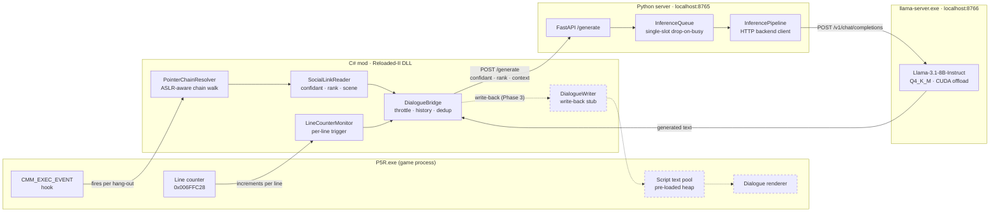

# P5R Generative Social Links

> *What if Ryuji actually remembered what happened last time you hung out?*

A [Reloaded-II](https://reloaded-project.github.io/Reloaded-II/) mod that replaces Persona 5 Royal's scripted Social Link dialogue with live AI generation — running entirely on your local GPU. No cloud, no API keys, no internet. Every conversation is unique.

[](https://github.com/SrijanSuresh/p5r-gen-social-links/actions/workflows/ci.yml)


---

## For people who haven't touched a compiler

Persona 5 Royal has 22 Social Link characters — Ryuji, Ann, Makoto, and so on. Every line they say is pre-written, fixed forever in the game's script. This mod hooks into the game's memory while it's running, reads who you're hanging out with and how close you are, sends that to a small AI model running on your own PC, and gets back a reply that sounds like that character at that moment in your relationship.

**Ryuji at Rank 4, gym hang-out — real Llama-3.1-8B output, generated locally:**
> *"Yo, Joker, finally getting some actual exercise for once, huh? You gotta step up your game if we wanna take down those corrupt hearts!"*

> *"Dude, we gotta keep movin'! You're slippin', Joker, get those reps back up!"*

Both took under a second on an RTX 4060. It generates in his voice, at the right emotional register for where you are in the friendship, without ever leaving your machine.

---

## Architecture



The two processes communicate over localhost HTTP. The C# mod lives inside P5R's process; the Python server is a separate process started before the game. If the server isn't up, the mod falls back to scripted dialogue silently.

### Component summary

| Component | Language | What it does |
|---|---|---|
| `PointerChainResolver` | C# | Walks `[moduleBase + 0x2A63EF0] → [CMM + 0x48]` to find the active session struct, VirtualQuery-guarding every dereference |
| `SocialLinkReader` | C# | Reads confidant ID, rank level, and scene number from the resolved struct |
| `LineCounterMonitor` | C# | Polls `0x006FFC28` (discovered via Cheat Engine) — fires on each dialogue line advance |
| `DialogueBridge` | C# | Leading-edge throttle (3s), rolling session history (8 entries), hash-based dedup, context budget management |
| `DialogueWriter` | C# | Write-back stub — ready for when the text pool pointer chain is confirmed via Ghidra |
| `InferencePipeline` | Python | Builds character-faithful prompts with rank-tier emotional guidance, then calls the backend |
| `LlamaServerClient` | Python | HTTP client for `llama-server`, speaking OpenAI chat-completions |
| `LlamaServerProcess` | Python | Spawns and supervises `llama-server.exe`; waits for weights, reaps on exit |
| `InferenceQueue` | Python | Single-slot async queue — drops concurrent requests rather than queuing stale dialogue |
| `postprocess.py` | Python | Strips OOC commentary, name prefixes, stage directions and wrapping quotes; folds text to ASCII for the game buffer; truncates at sentence boundaries |

---

## Project phases

### ✅ Phase 1 — Memory scaffold
Reverse-engineered the CMM session struct layout from Ghidra + live hex dumps. Established the ASLR-aware pointer chain. Confirmed confidant ID, rank, and scene number reading in-game.

### ✅ Phase 2 — LLM inference
Switched backend from auto-gptq to llama-cpp-python. Wired real Llama-3.1-8B-Instruct (Q4_K_M) inference through a FastAPI server. Confirmed end-to-end: game hang-out → C# hook → HTTP POST → GPU inference → generated dialogue logged. 54 commits, 119 automated tests.

**Confirmed working:**
- All 22 Social Link characters recognised by the inference pipeline
- Real inference latency: <2s on RTX 4060 after CUDA warmup
- Per-line trigger: `LineCounterMonitor` fires on each dialogue advance
- CI: GitHub Actions runs Python tests + .NET build on every push

### 🔄 Phase 3 — Dialogue write-back *(in progress)*

#### ✅ Real inference, out of process

The server previously ran in mock mode because `llama-cpp-python` was never installable
here — it is a C extension pinned to a CPython ABI, with no cp313 wheel and source-only
distribution. Inference now runs in an upstream `llama-server.exe` child process reached
over loopback HTTP, which needs no compiler, no CUDA Toolkit, and no particular Python
version. Measured: **~18 s model load, ~0.8–1.1 s per line, 0 drops.**

Two output defects surfaced only once real generations existed, and both are fixed:
Ryuji proposed to *"take down those Phantom Thieves"* — a group he co-leads — which is
now prevented by per-confidant world grounding that also keeps confidants who must not
know from mentioning them at all; and the model emitted stage directions, wrapping
quotes, and occasional non-ASCII, none of which survive an `Encoding.ASCII` write into
the game buffer.

#### 🏆 Milestone: mod-generated text rendered in-game, unaided

The mod locates the dialogue buffer on its own at runtime and writes to it. Generated text renders in Ryuji's speech bubble, drawn by the game's own renderer, with no external tooling involved:

> **Ryuji** — *"[MOCK rank 4] Dude, you're seriously the onl"*

This closes the central open question of the project. The full path is confirmed: the mod finds the pool, writes to it, and the renderer picks it up — pipeline output reaching the screen without a debugger attached.

An earlier checkpoint proved the mechanism by hand, freezing a Cheat Engine value to display `"Here we are... LLM WAS HERE!!!"`. The step above is the same result produced by the mod itself.

**What the hunt established:**

| Finding | Detail |
|---|---|
| Encoding | **ASCII**, single-byte — not UTF-16 |
| Location | **Heap** (`0x41DD7F6389`, `0x42102CAAA9`) — not the mapped BMD file region |
| Buffers | Two hold the live line; both accept writes |
| Delivery | Renderer reads the buffer **in place** — the text is never `memcpy`'d, so there is no copy to intercept |

Both facts in the first two rows were needed together, and searching either dimension alone finds nothing. Automated scans covered ASCII in the mapped-file region and UTF-16 in the heap, and so missed the text repeatedly; the address was ultimately pinned by a Cheat Engine string scan against the line visible on screen. Chapters 53–60 of `learning.md` document each wrong assumption and how it was ruled out.

**How the pool is currently located:** heap regions between `0x4100000000` and `0x4400000000` are walked via `VirtualQuery`, copied through `ReadProcessMemory` (a direct pointer walk races the game's allocator and faults fatally — see `learning.md` Ch. 61), and scored by `DialogueScore`, which weights sentence punctuation and second-person address. Every scored region is armed, not just the highest — the scene's own dialogue consistently ranked below a top-8 cutoff and was discarded before the write.

**Remaining for the phase:**

- **Narrow the write target.** Writing all armed regions is a confirmation strategy, not a shipping one: it overwrites unrelated game text and depends on the scene ranking inside the cap. Identifying which region rendered lets the rest be dropped.
- **Target the current line.** Every slot receives the same string, so all lines in a scene read alike. Lines are laid out sequentially in one allocation, so the live line is reachable by offset.
- **Hook the accessing instruction.** The buffer address changes every launch, but the instruction that reads it sits at a fixed module offset. Hooking it yields the pointer directly and removes the scan entirely.

### ⏳ Phase 4 — Per-line contextual generation
Use the `LineCounterMonitor` trigger and `SessionHistory` rolling buffer to generate dialogue that responds to the specific line the player just read — not just the hang-out metadata. Requires knowing which line index maps to which text entry in the script pool.

### ⏳ Phase 5 — Player custom dialogue
DirectX overlay for text input. Let the player type their own dialogue choice and have the NPC respond to it. This is the full social simulation vision.

---

## Technical details

### Inference stack

```
Llama-3.1-8B-Instruct (Meta)
  → GGUF Q4_K_M quantization    (~4.9 GB, fits in 8 GB VRAM)
  → llama-server.exe :8766       (upstream ggml-org build, CUDA offload)
  → FastAPI /generate :8765      (Pydantic validation, async queue)
  → C# HTTP client               (30s timeout, 3× retry on 503 cold-start)
```

**Why a subprocess rather than Python bindings.** `llama-cpp-python` is a C extension
pinned to a CPython ABI: official CUDA wheels stop at cp312, and PyPI ships source
only, so a Python 3.13 install would need the CUDA Toolkit and MSVC — on every machine
running the mod. A prebuilt `.exe` has no opinion about the interpreter talking to it.

The boundary pays for itself beyond the install: the API answers immediately instead of
blocking ~20 s on weights, a CUDA OOM no longer takes down the process the game is
talking to, and swapping the GGUF does not mean restarting the API. Because
`llama-server` speaks the OpenAI chat-completions schema — the same shape the binding
mirrored in-process — the port was a change of transport, not of contract.

Measured on an RTX 4060 8 GB: **~18 s model load, ~1.0 s per generation.**

### Prompt structure

Every request gets a three-layer prompt:

1. **System** — character identity, arcana, personality blurb, rank-tier emotional guidance (4 tiers: stranger / acquaintance / close friend / deepest bond)
2. **Context** — scene description, prior session dialogue (rolling 8-line buffer), trimmed to 1000 chars
3. **User** — `[Scene context: ...] CharacterName:`

### Memory layout (CMM session struct)

Offsets confirmed from live hex dump during Ryuji gym hang-out (session `0x41D7156660`):

```
+0x00  int32   ConfidantId     (8 = Ryuji)
+0x04  int32   SessionPhase    (always 0 in observed sessions)
+0x08  byte    CmmIdRepeat
+0x0A  byte    EventType       (2)
+0x0B  byte    RankLevel       (rank before this session)
+0x0C  int16   SceneNumber     (51 = Ryuji gym hang-out)
+0x10  ptr     [internal CMM pointers]
+0x20  byte    TimerLo         (16-bit game clock, low byte)
+0x21  byte    TimerHi         (16-bit game clock, high byte)
+0x3F  byte    StateParity     (toggles 0x80↔0x91 ~every 2s)
```

Static pointer chain: `[p5r.exe + 0x2A63EF0] → [+0x48] → session*`

---

## Setup

> Requires a Reloaded-II installation and an NVIDIA GPU with ≥8 GB VRAM.

**1. Clone and build the mod**
```powershell
git clone https://github.com/SrijanSuresh/p5r-gen-social-links
cd p5r-gen-social-links
dotnet build mod/P5RGenSocialLinks/P5RGenSocialLinks.csproj --configuration Release
```
The build auto-deploys to `%USERPROFILE%\Desktop\Reloaded-II\Mods\P5GenSocialLinks` when that folder exists. Reloaded loads the DLL from its own `Mods` directory, not from `bin/` — a successful build says nothing about what the game will actually load.

**2. Set up the Python server**
```powershell
cd server
python -m venv .wvenv
.\.wvenv\Scripts\activate
pip install -r requirements.txt   # fastapi, uvicorn, httpx — no compiler needed
```

**3. Fetch the inference engine**
```powershell
.\scripts\fetch-llama-server.ps1
```
Downloads the upstream `llama-server.exe` and the redistributable CUDA runtime into
`server/vendor/` (~640 MB, gitignored). No CUDA Toolkit or Visual Studio required —
the runtime DLLs ship in the archive.

Then download a Llama-3.1-8B-Instruct GGUF (Q4_K_M) to
`server/models/Meta-Llama-3.1-8B-Instruct-Q4_K_M.gguf`.

**4. Start server, then game**
```powershell
.\start.bat          # real inference — spawns llama-server as a child process
# or
.\start-mock.bat     # no GPU needed, canned responses for testing
```
Keep the window open while playing; closing it stops both processes.

**Run tests**
```powershell
cd server
python -m pytest tests/ -q
# 196 passed, 1 skipped
```
No GPU, model, or vendored binary needed — the inference backend is exercised through
`httpx.MockTransport` and stub processes.

---

## Repo structure

```
p5r-gen-social-links/
├── mod/P5RGenSocialLinks/       # C# Reloaded-II mod
│   ├── Memory/                  # Pointer chain, struct reading, write-back
│   ├── Server/                  # HTTP client, health checker
│   ├── Mod.cs                   # Entry point, poll loop, hook wiring
│   ├── DialogueBridge.cs        # LLM dispatch, throttle, session history
│   └── GenDialogue.json         # Runtime config (no recompile needed)
├── server/                      # Python inference server
│   ├── inference/               # Pipeline, llama-server client + supervisor, queue, postprocessor
│   ├── vendor/                  # llama-server.exe + CUDA runtime (gitignored, fetched)
│   ├── social_link/             # Arcana roster, prompt builder, tier mapping
│   ├── tests/                   # 196 tests (pytest)
│   └── main.py                  # FastAPI app
├── scripts/fetch-llama-server.ps1  # Downloads prebuilt llama.cpp CUDA binaries
├── scripts/redate.sh            # Spreads commits across PR window
├── learning.md                  # 63-chapter technical journal (the real docs)
└── .github/workflows/ci.yml     # Python tests + .NET build on push
```

---

## learning.md

`learning.md` is a 63-chapter technical journal written alongside the code — covering ASLR and pointer arithmetic, Triton block-pointer math, 4-bit quantization, BF script format, CI design, process lifetime and Windows Job Objects, and everything discovered via Cheat Engine and Ghidra. It exists because this project was built as a learning exercise as much as a mod.

---

*Built on Windows 11 · RTX 4060 8GB · P5R Steam (patch 1.0.3)*
